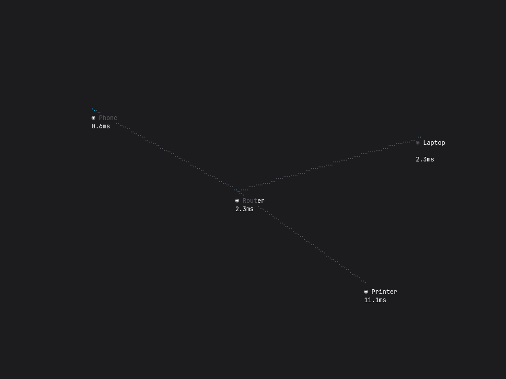

# LAN-TUI

A cinematic terminal dashboard that visualises the Local Area Network as an interactive node graph.



## Overview

LAN-TUI renders a live LAN topology as a 3D-projected node graph with real-time latency monitoring and smooth zoom transitions. A background scanner thread pushes network updates through an MPSC channel while the UI loop renders at 60 fps using a non-blocking event poll.

## Controls

| Key          | Action        |
| ------------ | ------------- |
| `Enter`      | Next state    |
| `q` / `Esc`  | Quit          |

## Architecture

```
┌─────────────────────────┐     mpsc::channel     ┌──────────────────┐
│ Background thread       │ ──────────────────►   │ UI render loop   │
│ (simulate_scan, 2-3 s)  │   tx.send(nodes)      │ rx.try_recv()    │
└─────────────────────────┘                       └──────────────────┘
```

- **Scanner** runs on a dedicated `std::thread::spawn` worker, jittering latency values deterministically every 2–3 seconds.
- **Render loop** polls for input at ~60 fps (`event::poll(Duration::from_millis(16))`), consumes channel updates via `try_recv()`, and drives the zoom animation.
- **Projection** maps each node's 3D world-space coordinates `(x, y, z)` onto a 2D terminal canvas using a configurable camera with scale and look-at target.

## Tech Stack

- **Language:** Rust
- **TUI:** ratatui + crossterm
- **Concurrency:** std::sync::mpsc
- **Error handling:** color-eyre

## State Machine

```
Splash → AnimatingIntro → Graph → AnimatingZoom → Detail → Splash
```

## Roadmap

| # | Step | Status |
|---|------|--------|
| 1 | Boilerplate & state machine | ✅ Complete |
| 2 | Background network discovery | ✅ Complete |
| 3 | 3D projection engine | ✅ Complete |
| 4 | Node graph rendering | ⏳ |
| 5 | Zoom & detail animations | ⏳ |

## Run

```bash
cargo run
```
